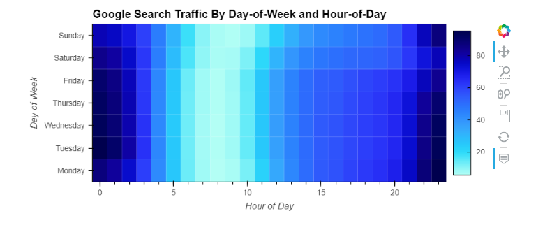
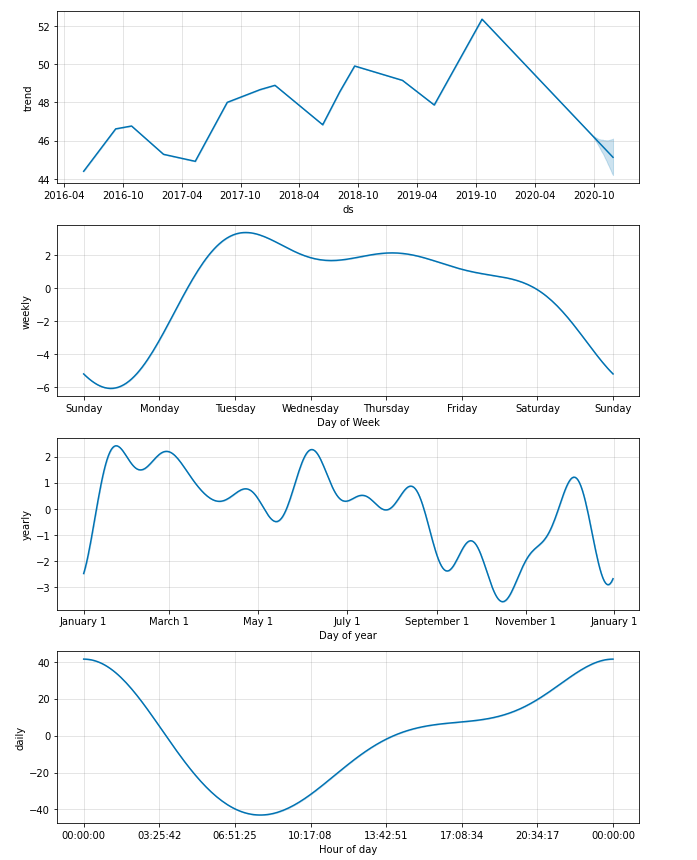
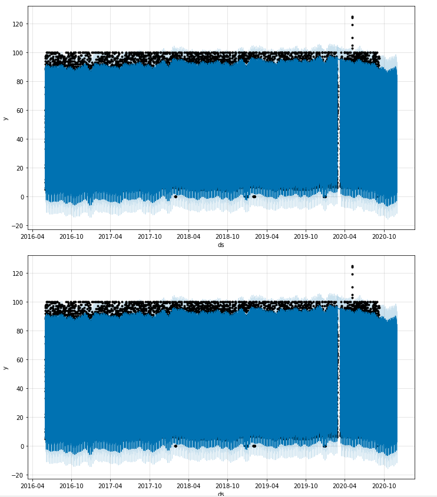
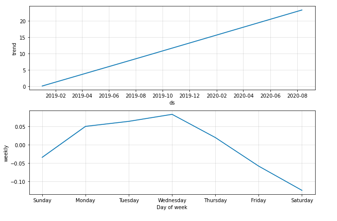

# Module-11-Challenge---MercadoLibre

## Instructions
First, configure a Google Colaboratory, or Colab, workspace as follows:

Open Google Colab (Links to an external site.), and then upload your starter notebook.

Run the provided code in the “Install and import the required libraries and dependencies” section. Note the following:

The first cell installs the necessary libraries into the Google Colab runtime.

The second cell imports the dependencies for use in the notebook.

With your workspace configured, you can begin the Challenge. The instructions are divided into four steps and an optional fifth step as follows:

Step 1: Find unusual patterns in hourly Google Search traffic.

Step 2: Mine the search traffic data for seasonality.

Step 3: Relate the search traffic to stock price patterns.

Step 4: Create a time series model by using Prophet.

Step 5 (optional): Forecast the revenue by using time series models.

Make sure to also create a README.md file that summarises your models and findings.

## Findings

* From the heatmap, we can find Tue, Wed and Thurs have more Google search traffic between 22 pm to 2 am.

* Note how volatility spiked, and tended to stay high, during the first half of 2020. This is a common characteristic of volatility in stock returns worldwide: high volatility days tend to be followed by yet more high volatility days. When it rains, it pours.

* In hour of day plot, 0:00 shows the greatest popularity.Tuesday gets the most search traffic.Mid Oct is the lowest point for search traffice in the year.

* The forecast shows the popularity of MercadoLibre may have a drop in Oct 2020.

* The quarterly sales forecast shows that the total sales for next quarter most likely will be  969.6m.The best scenario,it could go higher up to 1051.46m. The worst scenario, it could go lower to $887.24m.

